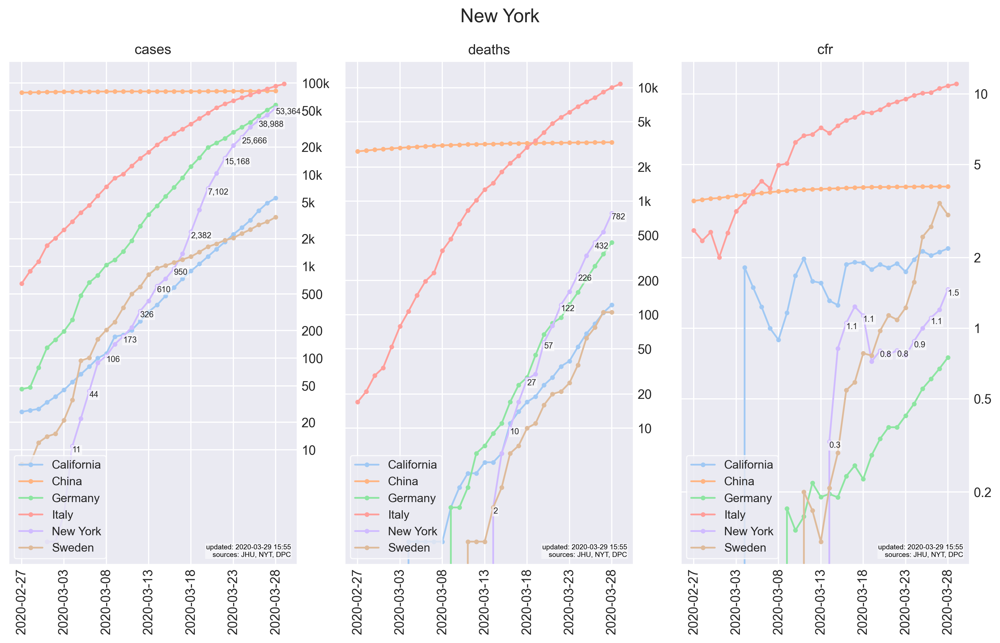

# covid-19
data analysis and modeling of COVID-19.

### examples

### how to clone/edit on a mac
1. have python 3 installed:
   1. `brew install pyenv`
   2. `pyenv install 3.8.0`
   3. `pyenv local 3.8.0`
2. install dependencies and run:
   1. [install poetry](https://poetry.eustace.io/docs/#installation)
   2. `poetry install`
   3. `poetry run jupyter notebook`
