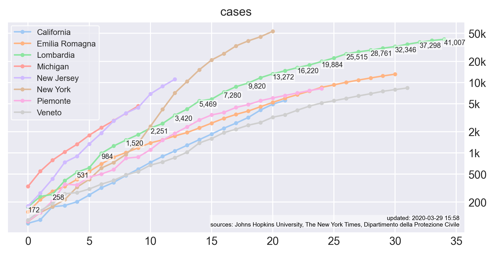

# covid-19
data analysis and modeling of COVID-19

### data sources
- global metrics from Johns Hopkins University https://github.com/CSSEGISandData/COVID-19
- US county-level metrics from The New York Times https://github.com/nytimes/covid-19-data
- Italy *regione*-level metrics from Dipartimento della Protezione Civile https://github.com/pcm-dpc/COVID-19

all data sources are timeseries with updated cumulative metrics for each day

### metrics
- cum. `cases`, `deaths`, and `recovered`, for most regions
- timeseries from 2020-01-22 onwards, for most regions
- derived metrics include: case fatality rate, active cases, day-over-day diffs, day-over-day % change

### examples
custom plots mixing any metrics for regions at multiple levels

### how to clone/edit on a mac
1. have python 3 installed:
   1. `brew install pyenv`
   2. `pyenv install 3.8.0`
   3. `pyenv local 3.8.0`
2. install dependencies and run:
   1. [install poetry](https://poetry.eustace.io/docs/#installation)
   2. `poetry install`
   3. `poetry run jupyter notebook`
